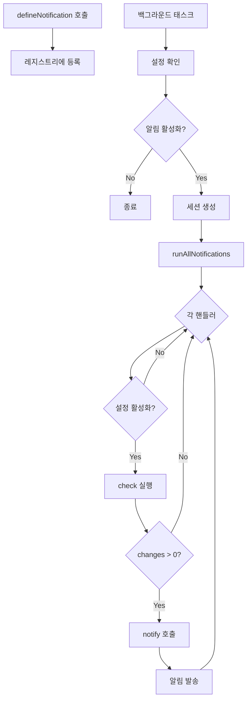
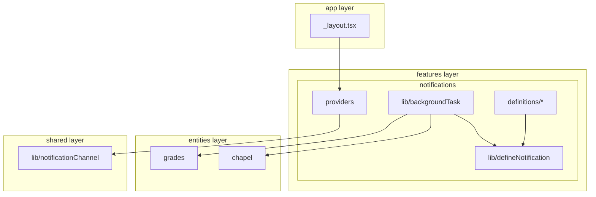

# 백그라운드 알림 서비스 구현 계획서

> **관련 문서**: [알림 설정 UI 구현 계획서](./NOTIFICATION_UI.md)

## 1. 개요

SSURF 앱에 백그라운드 알림 서비스를 추가하여 사용자가 성적 및 채플 정보 변경을 실시간으로 확인할 수 있도록 합니다.

### 1.1 알림 종류

| 알림                 | 설명                                | 설정 경로              |
| -------------------- | ----------------------------------- | ---------------------- |
| 과목별 성적 변경     | 개별 과목의 성적이 변경되었을 때    | `grades.classGrade`    |
| 학기별 성적 업데이트 | 학기 전체 성적 요약이 변경되었을 때 | `grades.semesterGrade` |
| 채플 출석 정보 변경  | 채플 출석 정보가 변경되었을 때      | `chapel.attendance`    |

### 1.2 핵심 설계 원칙

- **선언적 API**: `defineNotification`으로 알림 로직을 선언적으로 정의
- **자동 등록**: 정의만 추가하면 레지스트리에 자동 등록
- **단순한 계약**: `check` 함수가 배열을 반환하면 알림 트리거, 빈 배열이면 무시

---

## 2. defineNotification API

### 2.1 인터페이스

```typescript
interface NotificationDefinitionOptions<TChange> {
  key: string; // 알림 고유 키
  settingPath: string; // 설정 경로 (예: 'grades.classGrade')
  check: (ctx: NotificationContext) => Promise<TChange[]>; // 변경 확인 (페칭 + 비교)
  notify: (change: TChange) => NotificationContent; // 알림 콘텐츠 생성
}

interface NotificationContext {
  session: RusaintSession;
  currentSemester: { year: number; semester: number };
  studentId: string;
}

interface NotificationContent {
  title: string;
  body: string;
  subtitle?: string;
  data?: Record<string, unknown>;
}
```

### 2.2 동작 방식

1. `defineNotification` 호출 시 핸들러가 레지스트리에 자동 등록
2. 백그라운드 태스크 실행 시 등록된 모든 핸들러 순회
3. 각 핸들러의 `check` 함수 실행 → 변경 사항 배열 반환
4. 배열이 비어있지 않으면 각 변경에 대해 `notify` 호출 후 알림 발송

---

## 3. 파일 구조

```
src/features/notifications/
├── lib/
│   ├── defineNotification.ts     # API 정의
│   ├── notificationRegistry.ts   # 레지스트리
│   ├── notificationRunner.ts     # 실행기
│   ├── backgroundTask.ts         # 백그라운드 태스크
│   └── constants.ts
├── model/
│   └── index.ts                  # NotificationSettings 타입
├── providers/
│   └── NotificationProvider.tsx
└── definitions/
    ├── index.ts                  # 모든 정의 등록
    ├── classGrade.ts
    ├── semesterGrade.ts
    └── chapelAttendance.ts

src/shared/lib/
└── notificationChannel.ts        # Android 채널 설정
```

---

## 4. 아키텍처 흐름

### 4.1 알림 실행 흐름



### 4.2 레이어 구조



---

## 5. 알림 설정 모델

```typescript
interface NotificationSettings {
  enabled: boolean;
  grades: {
    classGrade: boolean;
    semesterGrade: boolean;
  };
  chapel: {
    attendance: boolean;
  };
}
```

---

## 6. 기술적 의존성

### 6.1 필요한 패키지

```bash
pnpm add expo-notifications expo-task-manager expo-background-task
```

### 6.2 app.config.ts 플러그인

- `expo-notifications`
- `expo-background-task` (startOnBoot: true)

---

## 7. 구현 단계

1. **기본 인프라**: 패키지 설치, 플러그인 설정, Android 채널 설정
2. **defineNotification API**: 핵심 함수, 레지스트리, 실행기
3. **알림 정의**: classGrade, semesterGrade, chapelAttendance
4. **백그라운드 태스크**: 태스크 정의 및 등록/해제

---

## 8. 새 알림 추가 가이드

1. `definitions/` 디렉토리에 새 파일 생성
2. `defineNotification<TChange>` 호출
3. `definitions/index.ts`에 import 추가
4. `NotificationSettings` 타입에 설정 경로 추가

---

## 9. 고려 사항

- **iOS**: 백그라운드 fetch 간격은 OS가 제어 (보장 안됨)
- **Android**: 최소 15분 간격, Doze 모드 영향
- **세션**: 백그라운드에서 rusaint 세션 새로 생성 필요
- **에러**: 개별 알림 실패가 다른 알림에 영향 없음
