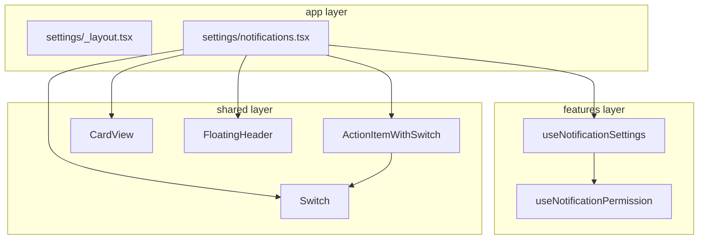

# 알림 설정 UI 구현 계획서

> **관련 문서**: [백그라운드 알림 서비스 구현 계획서](./NOTIFICATION_SERVICE.md)

## 1. 개요

SSURF 앱의 알림 설정 UI를 구현하여 사용자가 알림 기능을 쉽게 관리할 수 있도록 합니다.

### 1.1 주요 기능

- 알림 전체 활성화/비활성화 (마스터 토글)
- 개별 알림 설정 (성적, 채플)
- Settings Stack navigator를 통한 페이지 네비게이션

---

## 2. 공유 UI 컴포넌트

알림 설정 외에도 다양한 설정 항목에서 재사용 가능한 일반화된 컴포넌트.

### 2.1 Switch

플랫폼별 네이티브 Switch 래퍼.

```typescript
interface SwitchProps {
  value: boolean;
  onValueChange: (value: boolean) => void;
  label?: string;
  disabled?: boolean;
}
```

- **위치**: `src/shared/ui/primitives/Switch.tsx`
- **iOS**: `@expo/ui/swift-ui`의 Switch 사용
- **Android**: `@expo/ui/jetpack-compose`의 Switch 사용

### 2.2 ActionItemWithSwitch

ActionItem에 Switch가 포함된 형태.

```typescript
interface ActionItemWithSwitchProps {
  icon: React.ReactNode;
  title: string;
  description?: string;
  value: boolean;
  onValueChange: (value: boolean) => void;
  disabled?: boolean;
}
```

- **위치**: `src/shared/ui/primitives/ActionItemWithSwitch.tsx`

---

## 3. 파일 구조

```
src/
├── app/(tabs)/settings/
│   ├── _layout.tsx              # Stack navigator
│   ├── index.tsx                # 기존 설정 페이지
│   └── notifications.tsx        # 알림 설정 페이지
│
├── features/notifications/lib/
│   ├── useNotificationSettings.ts
│   └── useNotificationPermission.ts
│
└── shared/ui/primitives/
    ├── Switch.tsx
    └── ActionItemWithSwitch.tsx
```

---

## 4. 알림 설정 페이지 구조

```
┌─────────────────────────────────────┐
│ ← 알림 설정                         │
├─────────────────────────────────────┤
│ ┌─────────────────────────────────┐ │
│ │ 전체 알림                       │ │
│ │ 🔔 알림 받기              [🔘] │ │  ← 마스터 토글
│ └─────────────────────────────────┘ │
│                                     │
│ ┌─────────────────────────────────┐ │
│ │ 성적 알림                       │ │
│ │ 📊 과목별 성적 변경       [🔘] │ │
│ │ 📈 학기별 성적 업데이트   [🔘] │ │
│ └─────────────────────────────────┘ │
│                                     │
│ ┌─────────────────────────────────┐ │
│ │ 채플 알림                       │ │
│ │ 🐦 출석 정보 변경         [🔘] │ │
│ └─────────────────────────────────┘ │
│                                     │
│ ⓘ 백그라운드에서 주기적으로        │
│    정보를 확인하여 알림 발송        │
└─────────────────────────────────────┘
```

---

## 5. 훅 인터페이스

### 5.1 useNotificationSettings

```typescript
interface UseNotificationSettingsReturn {
  settings: NotificationSettings;
  isLoading: boolean;
  toggleEnabled: (enabled: boolean) => void;
  updateGradeSettings: (key: 'classGrade' | 'semesterGrade', value: boolean) => void;
  updateChapelSettings: (key: 'attendance', value: boolean) => void;
}
```

### 5.2 useNotificationPermission

```typescript
interface UseNotificationPermissionReturn {
  hasPermission: boolean | null;
  requestPermission: () => Promise<boolean>;
  checkPermission: () => Promise<void>;
}
```

---

## 6. 아키텍처



---

## 7. 구현 단계

1. **공유 컴포넌트**: `Switch`, `ActionItemWithSwitch` 구현
2. **Settings Stack**: `_layout.tsx` 생성, 기존 `settings.tsx` → `settings/index.tsx` 이동
3. **알림 설정 페이지**: `notifications.tsx` 구현
4. **훅 구현**: `useNotificationSettings`, `useNotificationPermission`

---

## 8. 수정 대상 파일

| 파일                          | 수정 내용                   |
| ----------------------------- | --------------------------- |
| `src/app/(tabs)/settings.tsx` | `settings/index.tsx`로 이동 |
| `src/app/(tabs)/_layout.tsx`  | settings 탭의 href 변경     |
